House Price Prediction - Assignment 1


## პროექტის მიმოხილვა

ეს პროექტი წარმოადგენს Kaggle-ის კონკურსს — **"House Prices: Advanced Regression Techniques"**. ამოცანა მარტივია: მოცემული გვაქვს საცხოვრებელი სახლების მონაცემები (80-მდე მახასიათებელი) და გვჭირდება **SalePrice**-ის პროგნოზი.

მონაცემთა ბაზა:
- **Train set:** 1460 სახლი, 80 feature + სამიზნე ცვლადი
- **Test set:** 1459 სახლი, 80 feature (SalePrice უცნობია)

პროექტის მთავარი მიზანი იყო არა მხოლოდ კარგი შედეგის მიღება, არამედ **სრული ML pipeline-ის** აგება: მონაცემთა ანალიზიდან დაწყებული, feature engineering-ის, hyperparameter tuning-ის, მოდელების შედარების და submission-ის ჩათვლით.

ექსპერიმენტებს ვინახავთ და შედარებითვის ვაკვირდებით **MLflow + DagsHub**-ის საშუალებით.

## პროექტის სტრუქტურა

```
ML-HousePricePrediction/
├── notebook_v1.ipynb     # EDA, Cleaning, Feature Engineering, Model Training
├── notebook_v2.ipynb     # Submission pipeline (MLflow model loading)
├── submission.csv        # Kaggle submission
└── README.md             # ეს ფაილი
```
---

## 1: მონაცემთა ანალიზი (EDA)

პირველ რიგში, მონაცემები ჩავტვირთე და გავეცანი მათ სტრუქტურას. Train set-ს ჰქონდა 81 სვეტი — ნაწილი რიცხვითი (ფართობი, წელი, ხარისხი...), ნაწილი კატეგორიული (სახურავის ტიპი, უბანი...).

### გამოტოვებული მნიშვნელობები

პირველი რაც გავაკეთე, **missing values-ის ანალიზი** — გამოვიყენე `isnull().sum()` და პროცენტული წილი ვიზუალიზაციასთან ერთად.

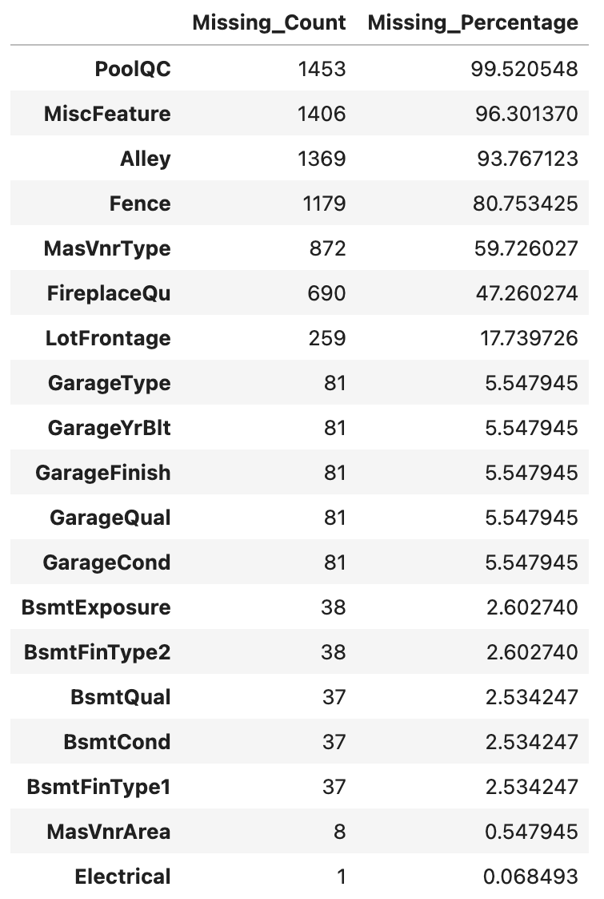
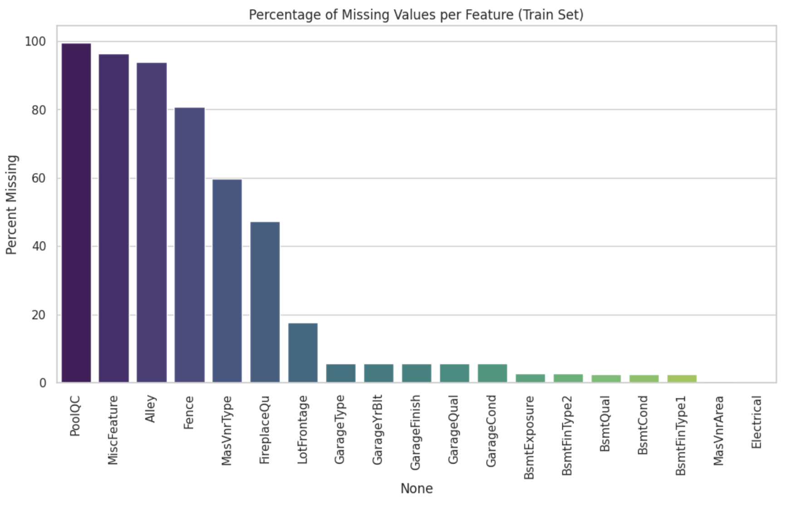

> **ვხედავთ, რომ:** `PoolQC` (~99.5%), `MiscFeature` (~96%), `Alley` (~93%), `Fence` (~80%) — ეს სვეტები თითქმის მთლიანად ცარიელია. `MasVnrType`-საც 60%-ზე მეტი აქვს გამოტოვებული. ეს მახასიათებლები ან ნამდვილად "არ გააჩნია" (სახლს აუზი არ აქვს - ამიტომ NaN), ან ზოგ შემთხვევაში უბრალოდ არარსებული ინფორმაციაა.

გადავწყვიტე ეს 5 სვეტი (PoolQC, MiscFeature, Alley, Fence, MasVnrType) **საერთოდ წამეშალა** — ისინი არ არიან საკმარისად ინფორმაციულები მოდელისთვის, შესაბამისად, ვიფიქრე, რომ გამოტოვებული ინფორმაციის შევსება უფრო მეტ ცდომილებას გამოიწვევდა და დააბნევდა მოდელს, ვიდრე ამ სვეტების თავიდან მოშორება.

### სამიზნე ცვლადის (SalePrice) განაწილება

```
Skewness: 1.8829
Kurtosis: 6.5363
```

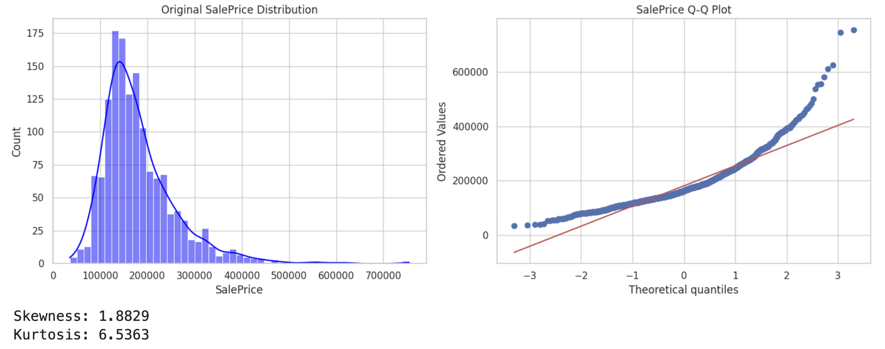

SalePrice **მარჯვნივ გადახრილია (right-skewed)** — ეს ნიშნავს, რომ ძვირი სახლები "კუდს" ქმნიან. Q-Q plot-ი ამ გადახრას ნათლად აჩვენებს — წერტილები არ ემთხვევა წითელ ხაზს.

ამიტომ ვიყენებ `log1p()` ტრანსფორმაციას სამიზნე ცვლადზე, ეს არის ხრიკი regression ამოცანებში, რადგან linear/tree მოდელები უკეთ მუშაობენ ნორმალურად განაწილებულ target-ზე. შემდგომ `expm1()`-ით ვაბრუნებ პროგნოზს ორიგინალ მასშტაბში.

---

## 2: მონაცემთა გაწმენდა (Data Cleaning)

EDA-ს შემდეგ train და test მონაცემები **გავაერთიანე** ერთ DataFrame-ში (feature-ებისთვის), რომ feature engineering ყველაფერზე ერთნაირად გამეკეთებინა.

### Missing Values-ის შევსება

**სტრატეგია განსხვავდება კონტექსტის მიხედვით:**

| სიტუაცია | მიდგომა | მიზეზი |
|----------|---------|--------|
| Garage/Basement კატეგ. სვეტები | `"None"` | NaN ნიშნავს "არ გააჩნია" |
| Garage/Basement რიცხვითი სვეტები | `0` | ფართობი/მანქანა = 0 |
| `LotFrontage` | Neighborhood-ის მედიანა | ერთ უბანში მდებარე სახლებს მსგავსი LotFrontage აქვთ |
| `MSZoning`, `Electrical`... | მოდა (mode) | იშვიათი missing - ყველაზე გავრცელებული მნიშვნელობა |

`LotFrontage`-ისთვის განსაკუთრებულ ლოგიკა გამოვიყენე:
```python
features['LotFrontage'] = features.groupby('Neighborhood')['LotFrontage'].transform(
    lambda x: x.fillna(x.median())
)
```
ეს იმაზე ჭკვიანური მიდგომაა, ვიდრე გლობალური მედიანა, რადგან სხვადასხვა უბანი სხვადასხვა ზომის ნაკვეთებს ატარებს.

---

## 3: Feature Engineering

### კატეგორიული ცვლადების ენკოდინგი

სახლის ხარისხის ამსახველი სვეტები (`ExterQual`, `KitchenQual`, `BsmtQual` და სხვ.) ტექსტური იყო, მაგრამ ორდინალური ლოგიკა ჰქონდათ. ამ მნიშვნელობებს **ხელით** მივანიჭე რიცხვები:

```python
quality_map = {'None': 0, 'Po': 1, 'Fa': 2, 'TA': 3, 'Gd': 4, 'Ex': 5}
```

ეს One-Hot Encoding-ზე ჯობია ამ შემთხვევაში, რადგან "Ex > Gd > TA" — ეს თანმიმდევრობა მნიშვნელოვანია, და მოდელი ასე უკეთ "მიხვდება" კავშირს.

### ახალი Feature-ების შექმნა

გადავწყვიტე, რომ **სახლის ფასი ერთ სვეტზე კი არ არის დამოკიდებული, არამედ რამდენიმე სვეტის ურთიერთქმედებასთანაა დაკავშირებული.** ამიტომ შევქმენი კომბინირებული feature-ები:

```python
df['TotalSF'] = df['TotalBsmtSF'] + df['1stFlrSF'] + df['2ndFlrSF']       # სრული ფართობი
df['TotalBaths'] = df['FullBath'] + 0.5*df['HalfBath'] + ...               # ყველა სველი წერტილი
df['TotalPorchArea'] = df['WoodDeckSF'] + df['OpenPorchSF'] + ...          # ტერასების სრული ფართობი
df['HouseAge'] = df['YrSold'] - df['YearBuilt']                            # სახლის ასაკი
df['RemodelAge'] = df['YrSold'] - df['YearRemodAdd']                       # ბოლო სარემონტოდან გასული დრო
df['TotalQuality'] = df['OverallQual'] + df['OverallCond']                 # ჯამური ხარისხი
df['HasPool'] = (df['PoolArea'] > 0).astype(int)                           # binary: აუზი გააჩნია?
df['Has2ndFloor'] = (df['2ndFlrSF'] > 0).astype(int)                      # binary: მეორე სართული?
df['HasGarage'] = ...
df['HasBsmt'] = ...
df['HasFireplace'] = ...
df['IsRemodeled'] = (df['YearRemodAdd'] != df['YearBuilt']).astype(int)    # გარემონტებულია?
```

**ლოგიკა:** ბინარული ნიშნები (HasPool, HasGarage...) ეხმარება მოდელს: ზოგჯერ **ყოლა/არყოლა** უფრო მნიშვნელოვანია, ვიდრე ზუსტი ზომა.

### კატეგორიული სვეტების One-Hot Encoding

დარჩენილი კატეგორიული სვეტებისთვის გამოვიყენე `OneHotEncoder`:
```python
ohe = OneHotEncoder(handle_unknown='ignore', sparse_output=False)
```

`handle_unknown='ignore'` — ეს მნიშვნელოვანია, რადგან test set-ში შეიძლება ისეთი კატეგორია გამოჩნდეს, რომელიც train-ში არ ყოფილა.

encoding-ის შემდეგ ვიღებ: **Train: (1460, 271), Test: (1459, 271)**

---

## 4: Feature Selection

ვიფიქრე, რომ 271 სვეტი ზედმეტია და ამ მახასიათებლებიდან ბევრი არაფრის მომცემი იქნებოდა, ტრენინგს შეანელებდა და მოდელს დააბნევდა. ამიტომ გავაკეთე ორ-ეტაპიანი სელექცია:

### ეტაპი 1: კორელაციის ფილტრი

თუ ორ feature-ს > 0.80 კორელაცია აქვს ერთმანეთთან, ერთ-ერთი ზედმეტია — ის ფაქტობრივად **ერთსა და იმავე ინფორმაციას ატარებს.** მოვიშორე 44 ასეთი სვეტი.

### ეტაპი 2: Feature Importance (RandomForest)

RandomForest-ით ვამოწმებ, რომელ feature-ებს **ყველაზე მეტი გავლენა** აქვთ პროგნოზზე. ვხედავ კუმულატიური მნიშვნელობის გრაფიკს — ვჭრი 96%-ის ზღვარზე.


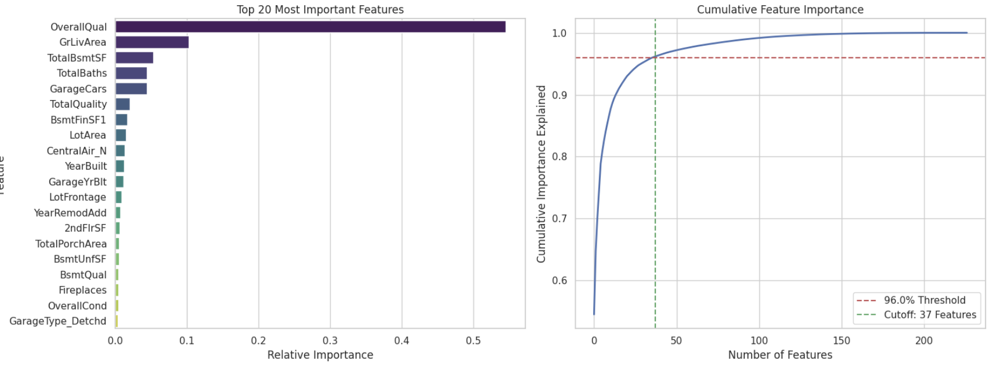


**შედეგად:** 227 სვეტიდან მხოლოდ **37** ვტოვებ — ეს 96% ინფორმაციაა. ტრენინგისას გავტესტე 95-98% შუალედში არსებული threshold-ები feature importance სელექციისას და შედეგებიდან გამომდინარე 96% შევარჩიე. 95%-ის შემთხვევაში მიიღებოდა 45 მახასიათებელი და არასტაბილური მოდელი, ხოლო მაღალი threshold-ის შემთვევაში 25 მახასიათებელი და არასაკმარისი ინფორმაცია მოდელისთვის.

### კორელაციის Heatmap

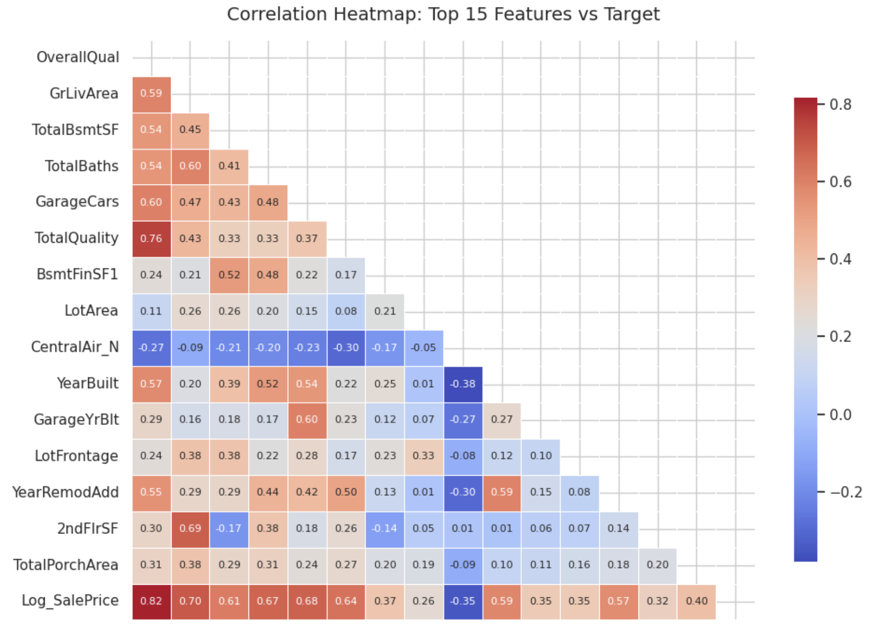

ამ heatmap-ზე ვხედავ Log_SalePrice-ის კორელაციას ყველა მნიშვნელოვან feature-თან:
- **OverallQual → 0.82** — ყველაზე ძლიერი კავშირი
- **GrLivArea → 0.70**, **GarageCars → 0.68**, **TotalBaths → 0.67**
- **CentralAir_N → -0.35** — უარყოფითი კორელაცია (ცენტრალური გათბობის **არარსებობა** ამცირებს ფასს)

---

## 5: გადახრილი Feature-ების დამუშავება

encoding-ის შემდეგ შევამოწმე numerical feature-ების skewness:

```
Found 23 highly skewed features out of 37 continuous features.
Top: LotArea (12.2), MSZoning_C (11.9), KitchenAbvGr (4.5)...
```

ყველა feature-ს, სადაც `|skewness| > 0.75` — `log1p()` ტრანსფორმაცია გავუკეთე. ეს linear მოდელებისთვის განსაკუთრებით კარგი დამხმარეა.

---

## 6: Linear მოდელები — Ridge და Lasso

### მიდგომა

Linear მოდელებს **StandardScaler** სჭირდება — სხვადასხვა მასშტაბის feature-ები ვერ ისწავლება ნორმალიზაციის გარეშე. Tree-based მოდელებს კი ნორმლიზაცია არ სჭირდებათ.

გამოვიყენე GridSearchCV + 5-Fold Cross-Validation, საუკეთესო პარამეტრების საპოვნელად და სანდო ვალიდაციისთვის.


### Ridge Regression

Ridge-ი L2 regularization-ს იყენებს — ყველა coefficient-ს ამცირებს, მაგრამ არ ანულებს.

```
Tested Alphas: [1.0, 10.0, 30.0, 50.0, 100.0, 200.0, 500.0]
Best Alpha: 10.0
TRAIN RMSE: 0.1297  |  TRAIN R2: 0.8930
VAL RMSE:   0.1358  |  VAL R2:   0.8816
Gap (Val - Train): 0.0061
```

**მივიღე ძალიან კარგი ბალანსი** Train-Validation gap = 0.006 — მოდელი არ არის overfitted.
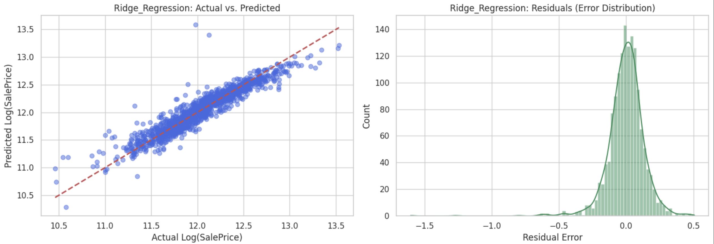


### Lasso Regression

Lasso-ი L1 regularization-ს იყენებს — ზოგ coefficient-ს **ნულამდე ამცირებს**, ანუ თავად ახდენს feature selection-ს.

```
Tested Alphas: [0.0005, 0.001, 0.005, 0.01, 0.05, 0.1]
Best Alpha: 0.001
TRAIN RMSE: 0.1299  |  TRAIN R2: 0.8928
VAL RMSE:   0.1356  |  VAL R2:   0.8819
Gap (Val - Train): 0.0057
```
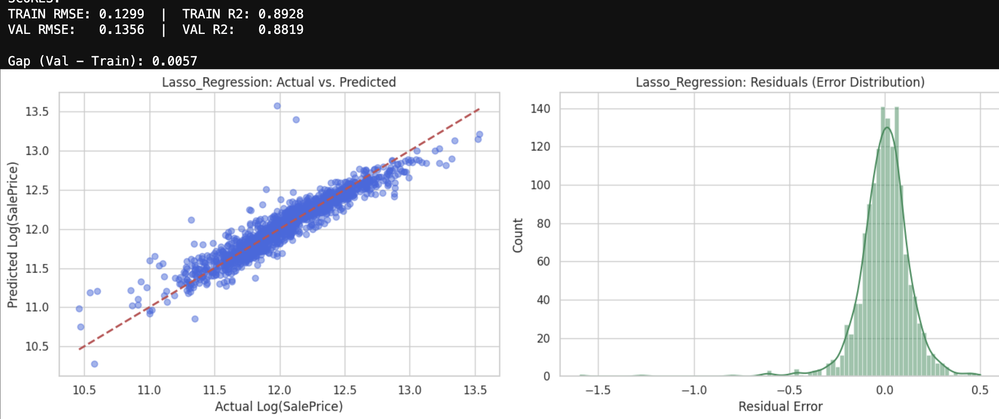

**Ridge-ი და Lasso-ი თითქმის **იდენტური** შედეგს იძლევა.** რაც ლოგიკურია, რადგან ისინი ერთ-ერთ ყველაზე "simple" მოდელებს წარმოადგენენ, და ამ მონაცემებზე 37 feature საკმარისია, ამიტომ L1/L2-ს ფორმა არ ცვლის სურათს.

---

## 7: Tree-Based მოდელები

### Decision Tree

Decision Tree-ს უდიდესი სისუსტე — **Overfitting** თუ depth-ს არ შევზღუდავ, ის ყველა სატრენინგო მონაცემს დაიზეპირებს და გენერალიზაციას ვერ მოახერხებს. 

```
Best Params: max_depth=6, min_samples_leaf=5, min_samples_split=5
TRAIN RMSE: 0.1386  |  TRAIN R2: 0.8783
VAL RMSE:   0.1963  |  VAL R2:   0.7571
Gap: 0.0577
```

მიუხედავად იმისა, რომ depth=6-ზე შევზღუდე, მაინც 0.0577 gap-ია — Decision Tree **სტრუქტურულად არის** overfit-სკენ მიდრეკილი.
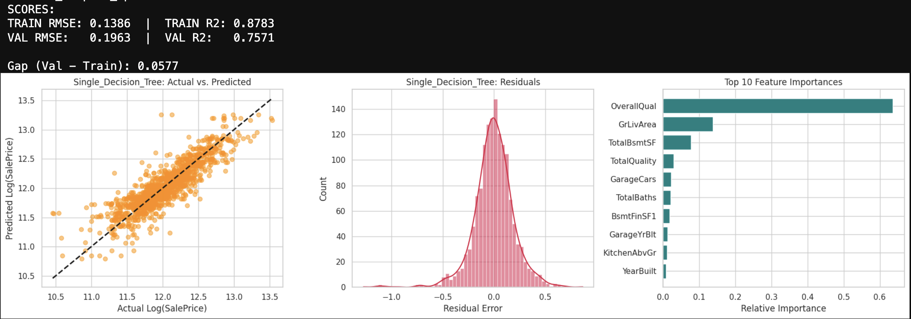


### Random Forest

Random Forest = Decision Tree-ების ერთობლიობა. თითოეული ხე სწავლობს **შემთხვევითი subset-ზე**, შემდეგ კი ყველა ხის პასუხის გასაშუალება ხდება.

**პრობლემა:** პირველ ექსპერიმენტებში Train R2 = 0.98+, Val R2 = 0.78 — **კლასიკური overfitting!**

**რა გავაკეთე:**
- `max_depth` შევამცირე (6 → 10, მაგრამ შეზღუდული)
- `min_samples_leaf` გავზარდე (სიმინიმუმ 4 sample leaf-ში)
- `max_features = 'sqrt'` ან `0.5` — ყოველ split-ზე feature-ების subset
- `min_samples_split` გავზარდე

```
Best Params: max_depth=10, max_features=0.5, min_samples_leaf=4, min_samples_split=10, n_estimators=150
TRAIN RMSE: 0.0928  |  TRAIN R2: 0.9469
VAL RMSE:   0.1383  |  VAL R2:   0.8787
Gap: 0.0455
```

გაუმჯობესება არის მაგრამ 0.0455 gap ჯერ კიდევ აშკარა overfit - ია. 
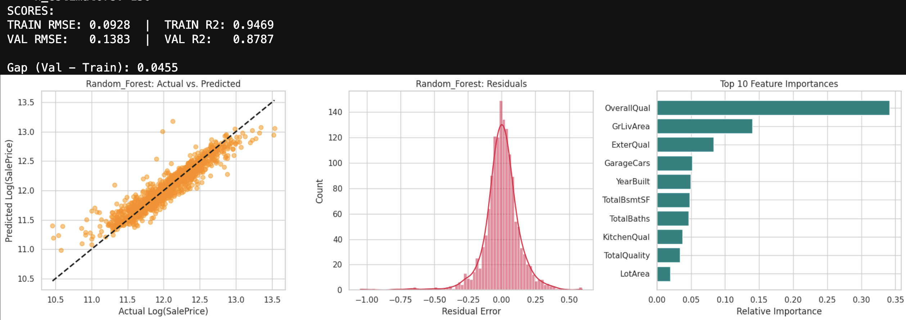


### Gradient Boosting

Gradient Boosting = ხეების **sequential** ერთობლიობა. ყოველი ხე ასწორებს წინა ხის შეცდომებს. ეს სტრატეგია ბევრად "ჭკვიანურია" ვიდრე Random Forest.

**ჩემი ექსპერიმენტები:**

პირველი მცდელობა: ღრმა ხეები → overfitting. მეორე: `max_depth=2` (!) — ძალიან მარტივი stumps. ვცადე learning_rate-ის შემცირება, შევზღუდე ხის სიღრმე, ფოთლების რაოდენობა.
```
Best Params:
  learning_rate: 0.04
  max_depth: 2         ← ძალიან shallow!
  max_features: 0.5
  min_samples_leaf: 15
  min_samples_split: 30
  n_estimators: 200
  subsample: 0.6       ← Stochastic GBM

TRAIN RMSE: 0.1167  |  TRAIN R2: 0.9132
VAL RMSE:   0.1342  |  VAL R2:   0.8858
Gap: 0.0175
```

**ეს ბევრად უკეთესია!** max_depth=2, subsample=0.6 — ეს regularization-ის ექვივალენტია Gradient Boosting-ში. Train-Val gap = 0.0175.
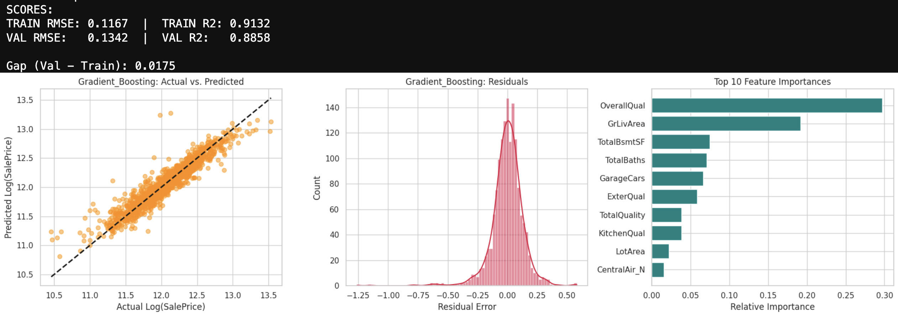


---

## 8: XGBoost

XGBoost - აქვს built-in regularization (L1 = `reg_alpha`, L2 = `reg_lambda`), parallel processing, და სხვა.

RandomizedSearchCV გამოვიყენე (40 iteration) — GridSearch-ს ბევრ პარამეტრზე ეს უფრო პრაქტიკულია.

```python
param_dist = {
    'n_estimators': [300, 400, 600],
    'learning_rate': [0.01, 0.02, 0.03],
    'max_depth': [4, 5, 6],
    'min_child_weight': [5, 10, 15],
    'subsample': [0.6, 0.7, 0.8],
    'colsample_bytree': [0.5, 0.6, 0.7],
    'gamma': [0.1, 0.2, 0.5],
    'reg_alpha': [0.0, 0.1, 0.5, 1.0],
    'reg_lambda': [1.0, 2.0, 5.0, 10.0]
}
```

```
Best Params: subsample=0.8, reg_lambda=2.0, n_estimators=600, min_child_weight=15,
             max_depth=4, learning_rate=0.02, gamma=0.1, colsample_bytree=0.5

TRAIN RMSE: 0.1015  |  TRAIN R2: 0.9345
VAL RMSE:   0.1320  |  VAL R2:   0.8894
Gap: 0.0305
```

**XGBoost > Gradient Boosting** ვალიდაციაზე. min_child_weight=15 ეხმარება overfitting-ის თავიდან აცილებაში.
აშკარა overfit ტენდენციის გამო, გავამკაცრე L1 და L2, რომ უფრო მეტად "დასჯილიყო" მოდელი ცდომილებისთვის. შევზღუდე ხის სიღმრე და შევამცირე learning rate. 
შედეგი არ იყო სტაბილური, ამიტომ მოდელს დავამატე ახალი მახასიათებლები (თავიდან მხოლოდ feature engineering-ში განხილული მახასიათებლების ნაწილი მქონდა დამატებული) და თავიდან ჩავატარე ხეებზე ეხპერიმენტი, რაც აშკარად დაეხმარა მოდელებს გენერალიზაციაში და გაუმჯობესება განსაკუთრებით მკაფიო იყო xgboost - თვის. 

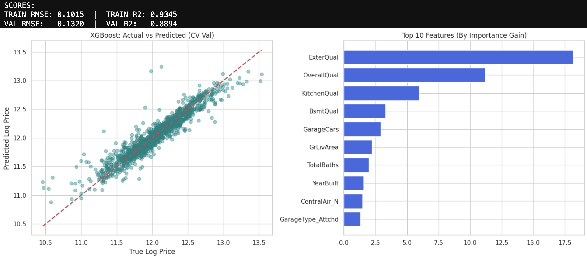

---

## 9: LightGBM — ბოლო მოდელი

### რატომ LightGBM?

XGBoost-ის შედეგის ნახვის შემდეგ გადავწყვიტე სხვა gradient boosting ფრეიმვორქიც მეცადა. Microsoft-ის მიერ შექმნილი LightGBM XGBoost-ისგან განსხვავდება რამდენიმე ასპექტით:

| | XGBoost | LightGBM |
|--|---------|----------|
| **ხის ზრდის სტრატეგია** | Level-wise (სიღრმე-სიღრმე) | Leaf-wise (საუკეთესო leaf-ი ირჩევა) |
| **სიჩქარე** | ნელი დიდ მონაცემებზე | ბევრად სწრაფი |
| **Regularization** | gamma, L1/L2 | num_leaves, min_child_samples |
| **მახასიათებელი** | - | GOSS + EFB ალგორითმები |

**Leaf-wise growth** ნიშნავს: LightGBM ყოველ იტერაციაზე ამატებს leaf-ს **ისეთ ადგილას, სადაც gain ყველაზე დიდია** — XGBoost-ი კი სიმეტრიულად ზრდის მთელ level-ს. ეს LGBM-ს ხშირად XGBoost-ზე ზუსტს ხდის, მაგრამ overfitting-ის რისკიც მეტია.

**ამიტომ LGBM-ში მთავარი regularization პარამეტრია `num_leaves`** — leaf-wise ხის "სიღრმის" ეკვივალენტი.

### პარამეტრების ძიება

```python
param_dist = {
    'n_estimators': [400, 600, 900],
    'learning_rate': [0.01, 0.02, 0.03],
    'num_leaves': [15, 31, 40],          # ← ეს LGBM-ის მთავარი კონტროლი!
    'max_depth': [-1, 3, 4, 5],
    'min_child_samples': [10, 20, 40],
    'feature_fraction': [0.6, 0.7, 0.8],  # colsample_bytree-ის ანალოგი
    'bagging_fraction': [0.6, 0.7, 0.8],  # subsample-ის ანალოგი
    'bagging_freq': [1, 3, 5],
    'reg_alpha': [0.0, 0.1, 0.5, 1.0],
    'reg_lambda': [0.5, 1.0, 2.0, 5.0]
}
# RandomizedSearchCV, 50 iteration
```

```
Best Params:
  reg_lambda: 5.0
  reg_alpha: 0.1
  num_leaves: 15       ← მცირე! overfitting-ის თავიდან ასაცილებლად
  n_estimators: 900    ← მეტი ხე, დაბალი learning rate-ით
  min_child_samples: 20
  max_depth: 5
  learning_rate: 0.01
  feature_fraction: 0.6
  bagging_freq: 3
  bagging_fraction: 0.7

TRAIN RMSE: 0.0903  |  TRAIN R2: 0.9464
VAL RMSE:   0.1299  |  VAL R2:   0.8927
Gap: 0.0395

```
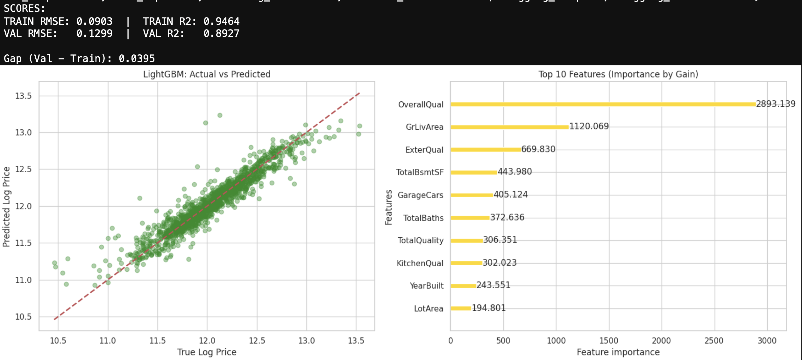

### ანალიზი

num_leaves=15 ძალიან მცირეა (default 31) — ეს ნიშნავს, მოდელი **შეზღუდულია**. მაგრამ სწორედ ამ შეზღუდვამ მისცა საუკეთესო ბალანსი. n_estimators=900 + learning_rate=0.01 — ეს კლასიკური კომბინაციაა: **ბევრი, მაგრამ "სუსტი" ხე.**

---

## მოდელების შედარება

| მოდელი | Train RMSE | Val RMSE | Train R² | Val R² | Gap |
|--------|-----------|----------|---------|-------|-----|
| Ridge | 0.1297 | 0.1358 | 0.8930 | 0.8816 | 0.0061 |
| Lasso | 0.1299 | 0.1356 | 0.8928 | 0.8819 | 0.0057 |
| Decision Tree | 0.1386 | 0.1963 | 0.8783 | 0.7571 | 0.0577 |
| Random Forest | 0.0928 | 0.1383 | 0.9469 | 0.8787 | 0.0455 |
| Gradient Boosting | 0.1167 | 0.1342 | 0.9132 | 0.8858 | 0.0175 |
| XGBoost | 0.1015 | 0.1320 | 0.9345 | 0.8894 | 0.0305 |
| **LightGBM** | **0.0903** | **0.1299** | **0.9464** | **0.8927** | 0.0395 |

**LightGBM** ყველაზე კარგ Val RMSE-ს (0.1299) და Val R²-ს (0.8927) გვაძლევს. Gap-ი 0.0395 — RandomForest-ზე ნაკლებია, მაგრამ Ridge-ზე მეტი. ეს ნორმალურია მისი სირთულის გათვალისწინებით.

---

## 🧪 MLflow ექსპერიმენტები

ყველა გაშვება **DagsHub + MLflow**-ში ავსახე. ეს საშუალებას მაძლევდა:
- ყოველი run-ის პარამეტრები და მეტრიკები დამემახსოვრებინა და საჭიროებისამებრ შემედარებინა ერთმანეთისთვის
- მოდელები Registry-ში დამერეგისტრირებინა და მარტივად ჩამომეტვირთვა

მაგ., Decision Tree-სთვის პირველ ვერსიებში ვხედავდი 0.98 train accuracy → შემდეგ პარამეტრები ვცვალე და  → 0.8783. MLflow ამ ისტორიას ინახავდა.

LightGBM ვარეგისტრირე Model Registry-ში (`models:/LightGBM/2`) და inference-ის კოდში პირდაპირ ჩამოვტვირთე:

---

## Kaggle Submission

**Kaggle Score: 0.130 RMSE (log scale)**


Submission pipeline:
1. Test მონაცემებზე **იგივე** preprocessing pipeline გავატარე (hardcoded SELECTED_FEATURES + HIGHLY_SKEWED_FEATURES)
2. MLflow Registry-დან ჩავტვირთე LightGBM მოდელი
3. პროგნოზი გავაკეთე log-space-ში
4. `expm1()` — ორიგინალ დოლარებში დავაბრუნე
5. `submission.csv` — Id + SalePrice ფორმატში

---

## შესაძლო გაუმჯობესებები

- **Ensemble / Stacking:** LightGBM + XGBoost + Ridge-ის weighted average — ეს გაუმჯობესება არ მიცდია, გვიან აღმოვაჩინე, თუმცა სხვა დროს გავითვალისწინებ.


---

